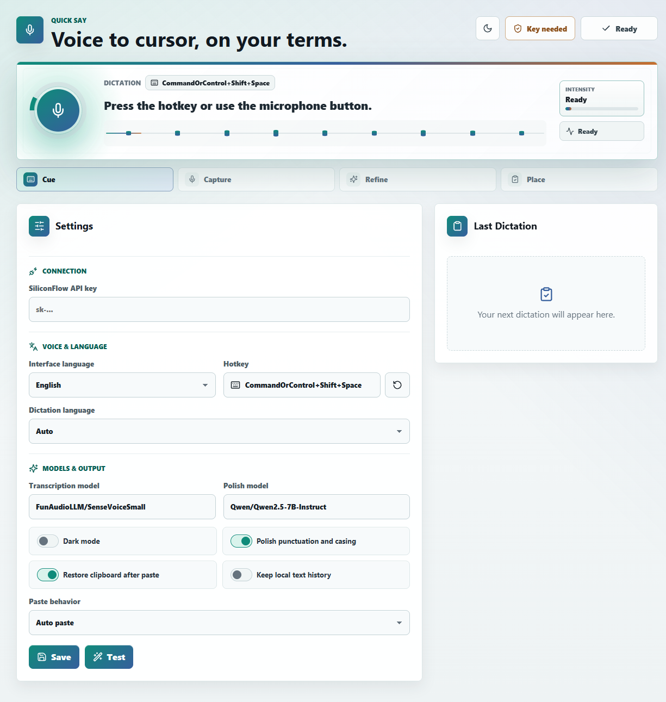

# Quick Say

[简体中文](docs/README.zh-CN.md)

<p align="center">
  
</p>

Quick Say is a free, local-first desktop dictation app. Press a global hotkey,
speak naturally, and Quick Say transcribes your voice with your own SiliconFlow
API key, optionally polishes the text, then places it at your cursor or copies it
to the clipboard.

The project is inspired by lightweight voice-to-text tools such as Typeless, but
keeps the app personal: no hosted backend, no bundled API account, and no
telemetry.

## Highlights

- Global hotkey dictation with a compact Tauri desktop UI.
- SiliconFlow transcription using `FunAudioLLM/SenseVoiceSmall` by default.
- Optional text polishing with `Qwen/Qwen2.5-7B-Instruct` by default.
- Auto paste into the active app, with a clipboard-only fallback mode.
- Clipboard restoration after paste when enabled.
- English and Chinese interface text.
- Light and dark UI modes.
- Local settings storage and API key storage in the operating system keyring.

## Screenshot



## Privacy Model

Quick Say is designed as a personal, local-first productivity tool.

- Your SiliconFlow API key is stored in the OS keyring.
- Preferences are stored locally by the desktop app.
- Audio is recorded to a temporary WAV file only long enough to send the
  transcription request.
- Raw audio is removed after processing, including cancellation and error paths.
- There is no hosted Quick Say backend, telemetry, analytics, or bundled account.

Because transcription and polishing use SiliconFlow, dictated audio and text are
sent to SiliconFlow according to your configured provider account and settings.

## Current Status

Quick Say is in early development. The core flow works from source, but packaged
release artifacts and installer documentation may not exist yet. Expect sharper
edges around platform permissions, global shortcuts, microphone access, and
automatic paste behavior while the app matures.

## Requirements

- Node.js and `pnpm` 9.14.2.
- Rust 1.77.2 or newer.
- Tauri v2 system dependencies for your operating system.
- A SiliconFlow API key.
- Microphone access for the desktop app.

On Linux, automatic paste requires either `wtype` or `xdotool`. Without one of
those tools, use clipboard-only mode.

## Getting Started

Clone the repository and install dependencies:

```bash
pnpm install
```

Run the desktop app in development mode:

```bash
pnpm tauri:dev
```

In the app:

1. Open Settings.
2. Add your SiliconFlow API key.
3. Confirm the transcription and polish models.
4. Save settings.
5. Press `CommandOrControl+Shift+Space`, or use the microphone button, to start
   dictation.

## Configuration

Quick Say defaults to:

| Setting | Default |
| --- | --- |
| Hotkey | `CommandOrControl+Shift+Space` |
| Interface language | English |
| Dictation language | Auto |
| Transcription model | `FunAudioLLM/SenseVoiceSmall` |
| Polish model | `Qwen/Qwen2.5-7B-Instruct` |
| Paste behavior | Auto paste |
| Restore clipboard | Enabled |
| Local text history | Disabled |

Settings can be changed from the app UI. API keys should not be committed,
logged, or stored in plaintext project files.

## Development Commands

Run the web frontend only:

```bash
pnpm dev
```

Run the Tauri desktop app:

```bash
pnpm tauri:dev
```

Build the frontend:

```bash
pnpm build
```

Build the desktop bundle:

```bash
pnpm tauri:build
```

Run frontend tests:

```bash
pnpm test
```

Run Rust checks and tests:

```bash
cd src-tauri
cargo check
cargo test
```

## Project Structure

```text
src/
  App.tsx          Main React UI and dictation state machine
  i18n.ts          English and Chinese UI messages
  settings.ts      Frontend defaults, validation, and hotkey formatting
  tauriApi.ts      Typed wrappers around Tauri commands
  types.ts         Shared frontend types

src-tauri/src/
  audio.rs         Temporary WAV recording
  commands.rs      Tauri command handlers
  lib.rs           App setup, tray, window, and global shortcut wiring
  paste.rs         Clipboard and paste behavior
  settings.rs      Local settings and OS keyring integration
  siliconflow.rs   SiliconFlow transcription and polish client
```

## Testing

Use the smallest relevant check while iterating, then broaden before opening a
pull request:

- Frontend validation, settings, or UI logic: `pnpm test`
- TypeScript or Vite changes: `pnpm build`
- Rust app behavior: `cd src-tauri && cargo test`
- Global shortcuts, tray behavior, clipboard, microphone, or provider flow:
  verify manually with `pnpm tauri:dev`

## Contributing

Contributions are welcome. Please keep changes aligned with the app's
local-first privacy model and compact desktop UX.

Before proposing a change:

1. Keep user-facing text in English and Chinese in sync.
2. Avoid logging API keys, raw audio, transcripts, or polished text.
3. Keep temporary audio cleanup reliable on success, cancellation, and errors.
4. Update frontend and Rust settings defaults together when changing shared
   settings.
5. Run the relevant tests listed above.

## Security

Please do not open a public issue for secrets, key handling flaws, or data
exposure concerns. If this repository has security contact details configured,
use them. Otherwise, contact the maintainers privately before publishing details.

## License

Quick Say is released under the [MIT License](LICENSE).
